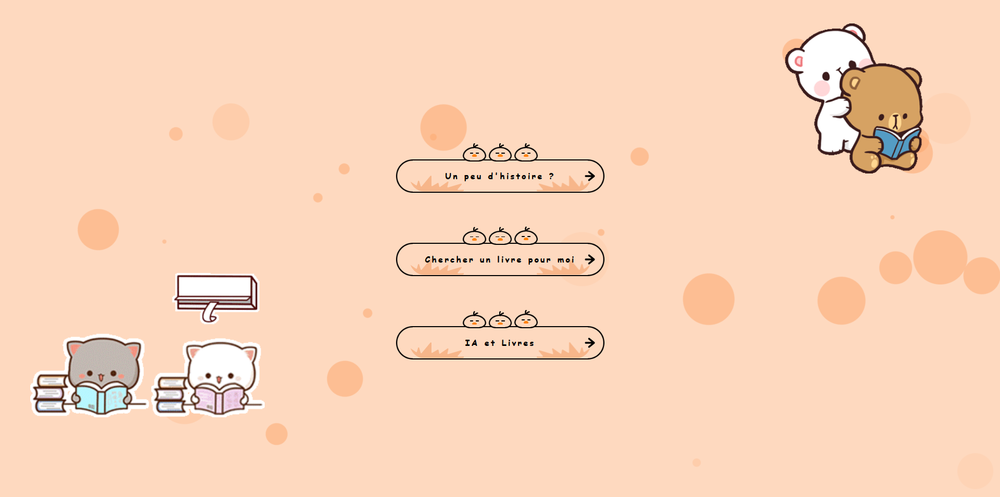

For the web app : 

You need to have React installed, and node.js with node package manager (npm)  

For the api, you mainly need to have python fastapi and uvicorn installed  

```sh
pip install fastapi
pip install uvicorn
```

For the machine learning file, you mainly need tensoflow, json, panda, numpy installed  

```sh
pip install tensorflow
pip install json
pip install panda
pip install numpy
```

It is possible to need other package (like pydantic), just follow your error to install which one you need  


## || Python Folder || : 

Contains all main content printed in web app  
- Data : contains some (not all, because of weight in github) data (forma csv only) used for graphics
- Graphics : contains python files to generate graphics avoiding the use of jupyter notebook for some graphics
- Model :
    - CategoryListGoogle.json : contains all category of books used by Google
    - DatabaseIA.json : contains 500 objects generated by aleatory to have a base for machine learning functionnality
- API.py : Contains the API function (see || Run API || for more information)
- MachineLearning.ipynb : contains all the algorithm of the machine learning on jupyter notebook to test faster

## || web_app Folder || :

Contains all visual web app
- Public : it's the sample folder create at beggining by react, contains index.html which allows to print all the app
- src : contains all the components of the application
    - assets : contains root css used in the app, like colors variables
    - components : contains all objects print in the app
    - images : contains the images used in the app, all format (git, png,svg, etc.)
    - layouts : contains the sections of the app, like the header and root page
    - pages : contains the components which contains itself the structur of the page and the route path
    - routes : regroup all route of the app
    - services : contains the api call to python
    - env : contains the path you use for load the application
    - views : contains all the component of the page you can see
- App.js : contains the root component of the app


## || First step ||
Before to make everything, you have to install all packages.  
Once done, you have to load the api, then you can load the web app.  

## || Run API ||
Under the root folder (Ynov_B3_Data_BookStoryTelling) :  
For this part, you have to be under the Python folder :  ```cd Python```  
You have to make the command :  ``` uvicorn API:app --reload```   
Once done, you can use Postman (or other app you want) and load the following routes :    

- GET (Get all genres in app) : http://127.0.0.1:8000/genres
- GET (Get all languages in app) : http://127.0.0.1:8000/languages
- POST (make a research with data): http://127.0.0.1:8000/search
- POST (make a research with input field): http://127.0.0.1:8000/research

Data example Search : 
```sh
{
    "genres": ["FICTION"],
    "languages": ["EN"]
}
```

Data example Research : 
```sh
{
    "labels": "Harry Potter 3" 
}
```


## || Run Web App ||
Under the root folder (Ynov_B3_Data_BookStoryTelling) :  
For this part, you have to be under the web_app folder :  ```cd web_app```  
You have to make the command : ```npm run start```   

Don't forget to make the command ```npm install``` the first time you install this project.  
Just wait and the app will open under one of your browser.  

If everything goes well, you will see the Home Page of the app :  


